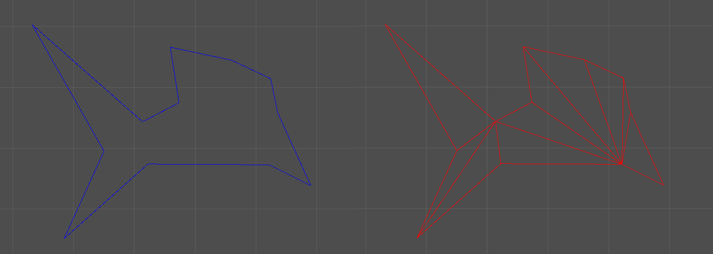

# Haze Triangulator 
**Haze Triangulator** is a small Unity tool which helps transforming 2D convex and concave non-self-intersecting polygons into collections of triangles which can be made into a Unity mesh to display. The tool allows creating clockwise and counterclockwise triangles so that faces can be selectively front-facing or back-facing depending on the geometry needed.

## Usage
Download the Unity package from [the latest release on GitHub](https://github.com/k-j0/haze-triangulator/releases/tag/v1.0), or simply place the file *Triangulator.cs* into your project's Assets folder.

To triangulate a 2D path, add `using Haze;` at the top of your code file, and call the static function `Triangulator.Triangulate()`, passing a `List<Vector2>` representing your vertices (this assumes the last vertex to be connected to the first, closing off the polygon; no two line segments of the polygon should intersect; the polygon can be either clockwise or counterclockwise). This will return a `List<Triangulator.Triangle>` which can then either be read through and operated upon by your code, or simply fed into `Triangulator.AddTrianglesToMesh()` to convert the triangles to a mesh (or add them to a pre-existing mesh).

For more information about the available functionality and how to use, please refer to the documentation included in the code.

You are free to email me at *[jonathan-kings@hotmail.com](mailto:jonathan-kings@hotmail.com)* for any questions or concerns about this code.

## Disclaimer
This asset makes use of code adapted from *[Setchi's Line Segment Intersection asset](https://github.com/setchi/Unity-LineSegmentsIntersection)*, used under the MIT license.

## License
MIT
